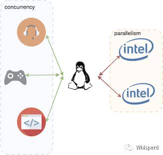
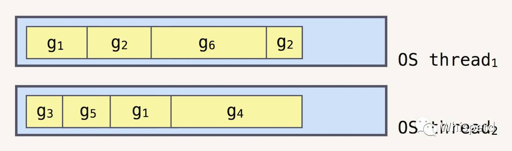
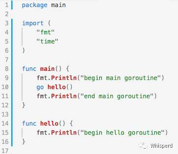
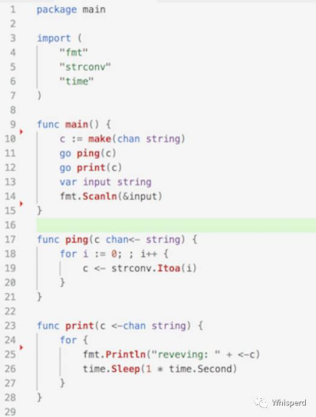
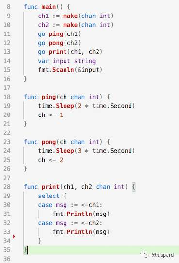

## 理解Golang并发编程

* Concurrency vs Parallelism
* Goroutine & channel & select

---

## Concurrency vs Parallelism

* 在程序中，并发强调的是独立执行程序的组合；并行强调的是同时执行计算任务;
* 计算机核心的数量决定了并行计算的能力.

Note: 并发和并行是彼此相关的两个概念，但不完全等价
人作为“单核”动物(老顽童小龙女除外)，可以说自己在并发某些任务，如我在听歌写代码，但不应该认为这两件事在并行执行，

----

- Golang的并发模型源于Communicating Sequential Processes (CSP);
- 通过提供goroutine和channel来实现并发编程模式.

---

Goroutine: 由Go运行时创建和管理
* 内存消耗更低只需2kB初始栈空间，而线程初始要1Mb的空间；
* 由golang的运行时环境创建和销毁，更加廉价，不支持手动管理；
* 切换效率更高等。

Note: 是Go用于调度CPU资源的“最小单元”，和OS的线程相比更轻量，Goroutine和线程的关系如图所示：

----

* 通过goroutine可以让一个函数和其他的函数并发执行，可以轻松地创建成百上千的goroutine，而不会降低程序的执行效率。  
* main 函数本身也是一个goroutine。

---

Channel: 完成多个goroutine之间的通信和同步
- c := make(chan string)
- c <- "ping" 表示向channel发送一个值为“ping”的字符串，
- msg := <- c 表示接收channel中的一个值，并赋給了msg

----

Note: 通过左箭头 `<-` 操作符操作channel变量。
channel是一种类型，关键字 chan 和channel传输内容的类型共同定义了channel的类型。定义方式为 var c chan string = make(chan string) ，这一channel中传输的类型为字符串。也可以简写为 var c = make(chan string) 或 c := make(chan string)。

----

按功能，可以将channel分为只发送或只接收channel：  
* 只允许发送: func ping(c chan<- string)
* 只允许接收: func print(c <-chan string)
* 不指定方向的channel被称作“双向”channel，可以将“双向”channel作为参数，传递给接收单向channel的函数，反之，则不行。

Note: 通过修改函数签名的channel形参类型来指定channel的“方向” 
任何对只发送channel的接收操作和只接收channel的发送操作都会产生编译错误

----

Unbuffered channel,也就是缓冲池大小为0的channel或者同步channel，可以通过数据交换来保证两个goroutine的状态同步：
* ch := make(chan int)
* ch := make(chan int, 0)

Note: 非缓冲channel在同步读时，如果channel的sendq中有就绪的goroutine，那么就取出（copy）数据并释放发送方goroutine；如果没有就绪的goroutine，那么将接收方goroutine挂起。  
非缓冲channel在同步写时，如果channel的recvq中有就绪的goroutine，那么就取出（copy）数据到接收方goroutine，并使其就绪；如果没有，那么将发送发goroutine挂起。

----

Buffered channel

缓冲channel只能容纳固定量的数据，当缓冲池满之后，发送方被阻塞，直到数据被接收释放缓冲池：
* ch := make(chan int, 5)
* 缓冲channel可以用来限制吞吐量

Note: 上面的栗子中，我们定义了一个容量为5的缓冲channel，每当从请求队列中接收到一个请求时，就发送一个信号给channel，然后用一个新的goroutine去处理请求，当处理完毕，释放（接收一个信号）缓冲池。这样做，就可以限制并发处理的请求数量不超过5个。每隔4秒钟，输出：

---

Select: 用于操作channel ，基本原则如下：
* select选择第一个就绪的channel进行处理
* 如果有多个就绪的channel，则随机选择channel进行处理
* 如果没有就绪的channel，则等待直到某channel就绪
* 如果有 default ，则在3中不会等待，而是立即执行default中的语句

----

---

* Golang将线程抽象出来成为轻量级的goroutine，开发者不再需要过多地关注OS层面的操作;  
* Channel作为通信的媒介，安全高效的实现了goroutine之间的通信和内存共享。  

----

> Do not communicate by sharing memory; instead, share memory by communicating.

Note: 最后，用Effetive go中的一句话来总结：